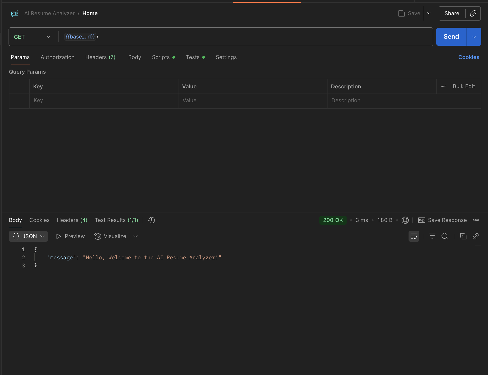

# AI Resume Analyzer Project

AI Resume Analyzer is a FastAPI-based backend application that leverages OpenAI structured outputs to evaluate resumes against job descriptions.

The application analyzes candidate profiles, identifies strengths and weaknesses, provides recommendations, and stores request and response history.

## Features

* Resume analysis using OpenAI
* Job description matching
* Structured responses with Pydantic models
* Persistent request and response storage
* Request and response retrieval by ID
* Cascading delete functionality
* JSON-based storage
* RESTful API endpoints
* Automatic API documentation through Swagger UI

## Technologies

* Python
* FastAPI
* OpenAI API
* Pydantic
* UV
* Uvicorn

## Project Structure

```text
app/
├── main.py
├── storage.py
├── data/
├── models/
├── routes/
├── services/
└── utils/
```

## Quick Start

Clone repository
    ```bash
   git clone https://github.com/jeffamady/ai-resume-analyzer.git

Install dependencies:
   ```bash
   uv sync
   ```

Create a .env file:

```text
OPENAI_API_KEY=your_api_key_here
```

Start the application:

```bash
cd app
uvicorn main:app --reload
```

Access Swagger documentation:

```text
http://localhost:8000/docs
```

## Example Request

```json
{
  "resume_data": "...",
  "job_description": "..."
}
```

## Endpoints

### GET /

Welcome message


### POST /api/v1/resume/analyze

Analyze a resume against a job description.

### GET /api/v1/resume/requests

Retrieve all requests.

### GET /api/v1/resume/requests/{id}

Retrieve a request by ID.

### GET /api/v1/resume/responses

Retrieve all AI responses.

### GET /api/v1/resume/responses/{id}

Retrieve a response by ID.

### DELETE /api/v1/resume/requests/{id}

Delete a request and its associated AI response.

## Future Improvements

* Database integration with PostgreSQL
* Docker support
* Unit testing
* Authentication and authorization
* Frontend application
* Streamlit dashboard
* Vector database support
* Semantic resume search
* Deployment to Render or Railway
* CI/CD pipelines using GitHub Actions
